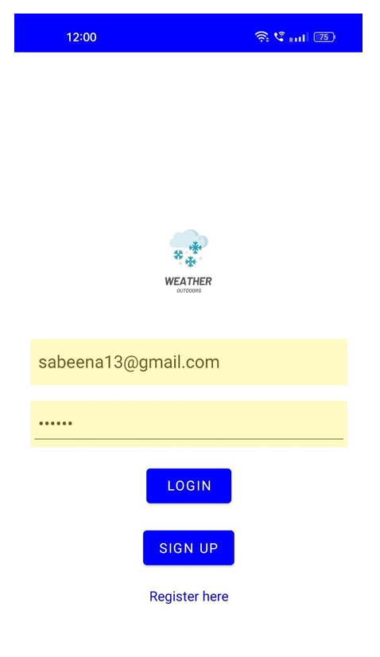
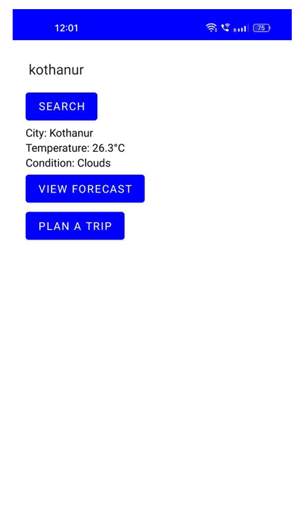
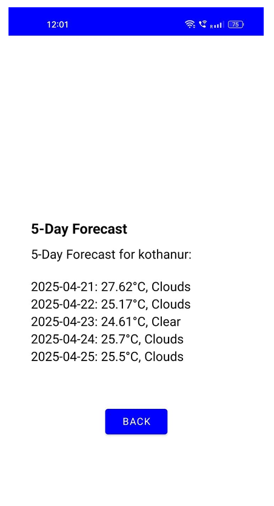
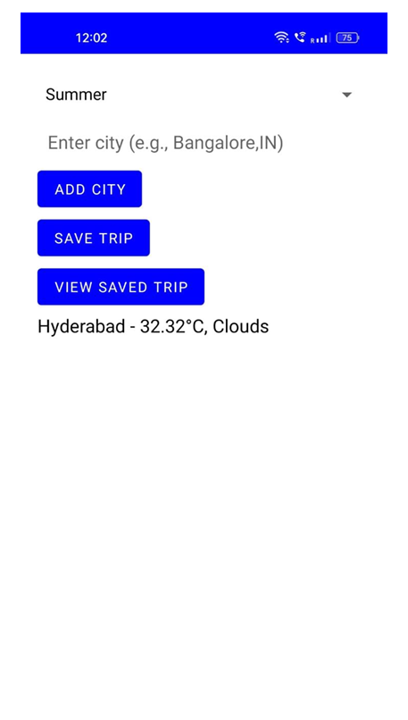

# Weather Management System

## Overview
This is an Android-based weather application developed during my BCA.

It provides real-time weather updates and 5-day forecasts using API integration, along with trip planning features.

## Features
- User Login & Registration (Local Storage)
- Real-time Weather Data (OpenWeatherMap API)
- 5-Day Forecast
- City Search
- Trip Planning (Save city + season)

## Tech Stack
- Kotlin
- Android Studio
- OpenWeatherMap API
- SharedPreferences

## Screenshots

### Login Screen

### Home Screen

### Forecast

### Trip Planner

## Documentation
Full project report is available in this repository.

## Note
This repository contains project documentation and screenshots. The original source code is currently unavailable.
